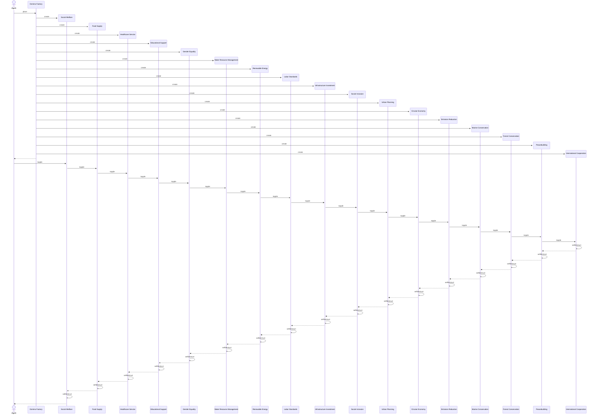

```mermaid
sequenceDiagram
    actor Agent
    participant DominoFactory as Domino Factory

    Agent->>DominoFactory: place
        create participant Domino1 as Social Welfare
        DominoFactory->>+Domino1: create
        create participant Domino2 as Food Supply
        DominoFactory->>+Domino2: create
        create participant Domino3 as Healthcare Service
        DominoFactory->>+Domino3: create
        create participant Domino4 as Educational Support
        DominoFactory->>+Domino4: create
        create participant Domino5 as Gender Equality
        DominoFactory->>+Domino5: create
        create participant Domino6 as Water Resource Management
        DominoFactory->>+Domino6: create
        create participant Domino7 as Renewable Energy
        DominoFactory->>+Domino7: create
        create participant Domino8 as Labor Standards
        DominoFactory->>+Domino8: create
        create participant Domino9 as Infrastructure Investment
        DominoFactory->>+Domino9: create
        create participant Domino10 as Social Inclusion
        DominoFactory->>+Domino10: create
        create participant Domino11 as Urban Planning
        DominoFactory->>+Domino11: create
        create participant Domino12 as Circular Economy
        DominoFactory->>+Domino12: create
        create participant Domino13 as Emission Reduction
        DominoFactory->>+Domino13: create
        create participant Domino14 as Marine Conservation
        DominoFactory->>+Domino14: create
        create participant Domino15 as Forest Conservation
        DominoFactory->>+Domino15: create
        create participant Domino16 as Peacebuilding
        DominoFactory->>+Domino16: create
        create participant Domino17 as International Cooperation
        DominoFactory->>+Domino17: create
        DominoFactory-->>Agent: 

    Agent->>Domino1: topple
        Domino1->>Domino2: topple
            Domino2->>Domino3: topple
                Domino3->>Domino4: topple
                    Domino4->>Domino5: topple
                        Domino5->>Domino6: topple
                            Domino6->>Domino7: topple
                                Domino7->>Domino8: topple
                                    Domino8->>Domino9: topple
                                        Domino9->>Domino10: topple
                                            Domino10->>Domino11: topple
                                                Domino11->>Domino12: topple
                                                    Domino12->>Domino13: topple
                                                        Domino13->>Domino14: topple
                                                            Domino14->>Domino15: topple
                                                                Domino15->>Domino16: topple
                                                                    Domino16->>Domino17: topple
                                                                        Domino17-xDomino17: selfdestruct
                                                                        # destroy Domino17
                                                                        Domino17-->>Domino16: 
                                                                    Domino16-xDomino16: selfdestruct
                                                                    # destroy Domino16
                                                                    Domino16-->>Domino15: 
                                                                Domino15-xDomino15: selfdestruct
                                                                # destroy Domino15
                                                                Domino15-->>Domino14: 
                                                            Domino14-xDomino14: selfdestruct
                                                            # destroy Domino14
                                                            Domino14-->>Domino13: 
                                                        Domino13-xDomino13: selfdestruct
                                                        # destroy Domino13
                                                        Domino13-->>Domino12: 
                                                    Domino12-xDomino12: selfdestruct
                                                    # destroy Domino12
                                                    Domino12-->>Domino11: 
                                                Domino11-xDomino11: selfdestruct
                                                # destroy Domino11
                                                Domino11-->>Domino10: 
                                            Domino10-xDomino10: selfdestruct
                                            # destroy Domino10
                                            Domino10-->>Domino9: 
                                        Domino9-xDomino9: selfdestruct
                                        # destroy Domino9
                                        Domino9-->>Domino8: 
                                    Domino8-xDomino8: selfdestruct
                                    # destroy Domino8
                                    Domino8-->>Domino7: 
                                Domino7-xDomino7: selfdestruct
                                # destroy Domino7
                                Domino7-->>Domino6: 
                            Domino6-xDomino6: selfdestruct
                            # destroy Domino6
                            Domino6-->>Domino5: 
                        Domino5-xDomino5: selfdestruct
                        # destroy Domino5
                        Domino5-->>Domino4: 
                    Domino4-xDomino4: selfdestruct
                    # destroy Domino4
                    Domino4-->>Domino3: 
                Domino3-xDomino3: selfdestruct
                # destroy Domino3
                Domino3-->>Domino2: 
            Domino2-xDomino2: selfdestruct
            # destroy Domino2
            Domino2-->>Domino1: 
        Domino1-xDomino1: selfdestruct
        # destroy Domino1
        Domino1-->>Agent: 󠄀
```